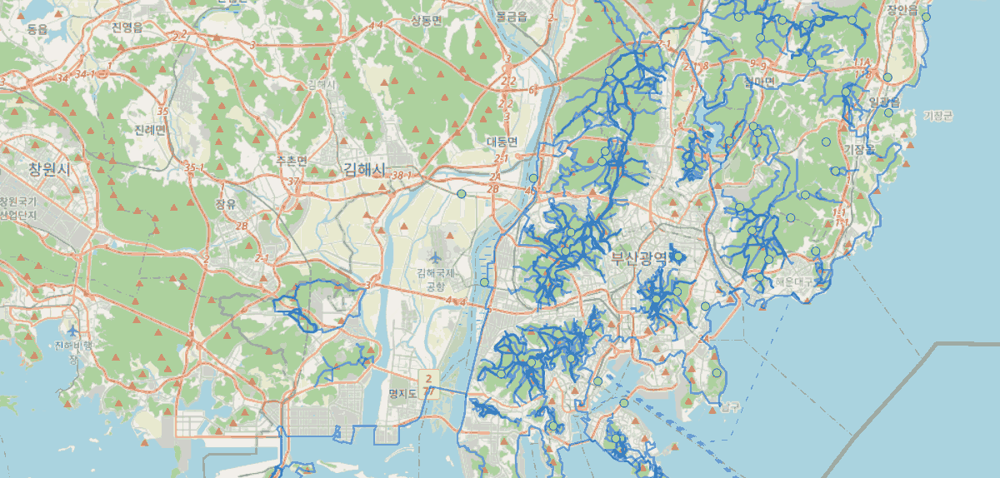

# busan_trails

GPX tracks and waypoints for hiking around **Busan, South Korea**:

- **154 peak-track files** (e.g. `cheonmasan_5213020083_01.gpx`) covering the city's named summits.
- **21 Galmaetgil coastal-trail sections** (`galmaetgil_*.gpx`) forming the walking route around Busan.
- **2 waypoint layers** containing the 38 highest peaks and 13 campsites.

A peak may have several route variants, each stored as a separate `<trk>`, so the map contains **837 items** in total.

Track fusion is still a work in progress.

## Viewing

Open https://odinokov.github.io/busan_trails in a browser — it's a fully self-contained page with all tracks embedded, generated using [`gpx_inspector.py`](https://github.com/odinokov/hktrails).

The `.gpx` files in `maps/` import into any GPS app, watch or handheld. On **Android we recommend [AlpineQuest](https://www.alpinequest.net/)** for offline maps + imported tracks/waypoints.

## License

The source dataset was published by the Korea Hiking & Trekking Support Center (한국등산트레킹지원센터) through the Tranggle archive: [data.go.kr/15108086](https://www.data.go.kr/data/15108086/fileData.do).

It is designated **이용허락범위 제한 없음** (“no usage restrictions”) and may be used, redistributed, modified, and used commercially without attribution or no-derivatives restrictions.

The derived files in this repository—including DEM-corrected elevations and regrouped or fused tracks—are the repository's own work.